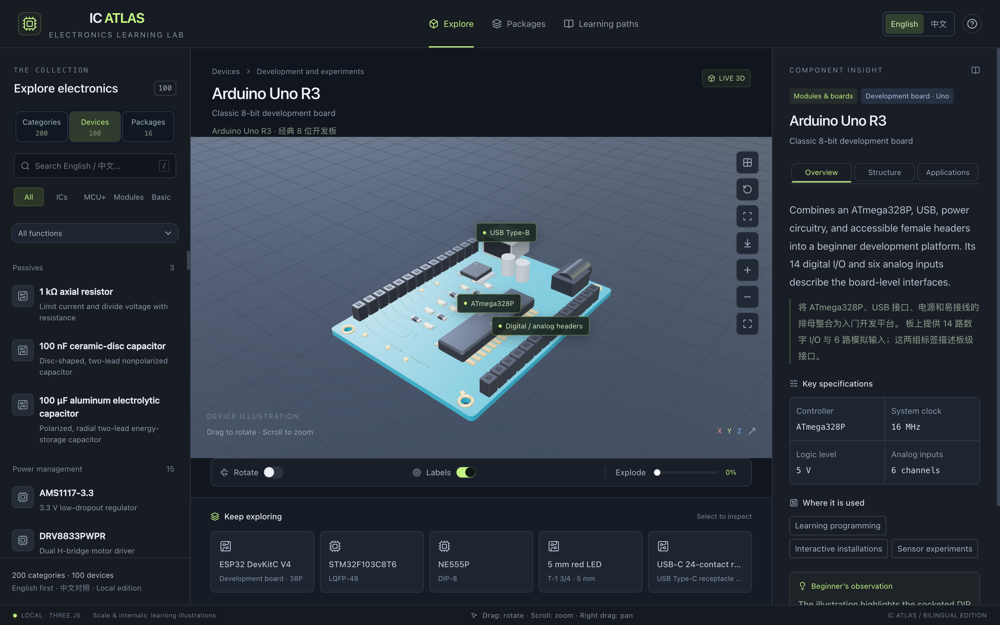
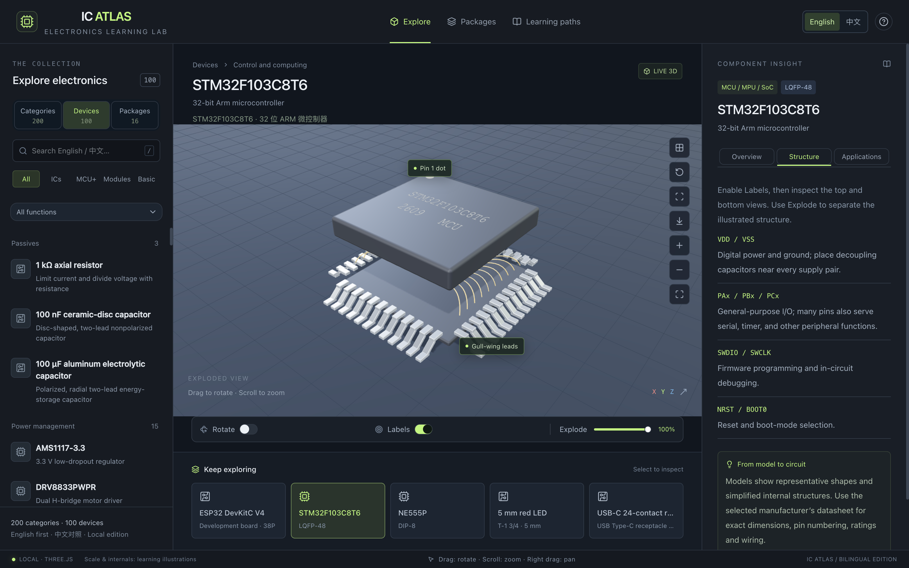
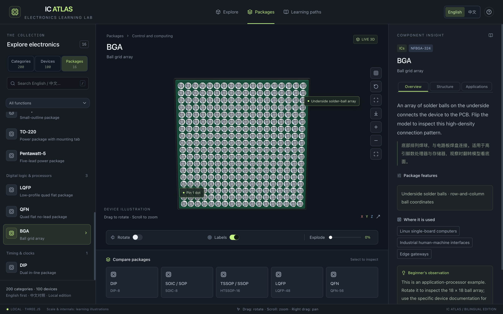

# IC Atlas

**English** | [简体中文](README.zh-CN.md)

An interactive 3D electronics learning lab built with React and Three.js. Explore **200 component categories**, **100 representative devices** and **16 common package types**, from resistors and connectors to microcontrollers, power ICs and RF components.

**[Open the live lab →](https://vaenshine.github.io/ic-atlas/)**

English is the default language. Switch to Chinese at any time; the app remembers your preference. Search accepts both languages, and learning notes, controls and model annotations follow the selected language.

## Screenshots

Captured from the running application. The Chinese README includes the same views with Chinese controls and notes.

### Explore the workbench

Inspect the Arduino Uno R3, identify its processor and connectors, and read the learning notes alongside the model.



### Reveal the structure

Expand the STM32F103C8T6's LQFP package to reveal the illustrated lead frame and bond wires, with pin-function notes beside it.



### Learn common packages

Flip a BGA package to inspect its 18 × 18 solder-ball array, then compare it with other package types.



## What you can learn

| View           | Content                                                                                                                                                                                                                                                             |
| -------------- | ------------------------------------------------------------------------------------------------------------------------------------------------------------------------------------------------------------------------------------------------------------------- |
| **Categories** | 200 component families across 13 groups: passives, power management, discrete semiconductors, analog and conversion, digital logic and processors, memory, wired interfaces, sensors, optoelectronics, connectors, RF and wireless, timing and clocks, and modules. |
| **Devices**    | 100 specific examples with specifications, pin notes, applications and manufacturer references. Category cards link to related examples where available.                                                                                                            |
| **Packages**   | 16 guides covering DIP, SOIC/SOP, TSSOP/SSOP, LQFP, QFN, BGA, TO-220, SOT-223, SOT-23-5, SOT-23-6, DO-35, DO-41, SMA, TO-92, TO-263-5 and Pentawatt-5.                                                                                                              |

Four guided learning paths introduce basic components, package recognition, development boards and the sensor-to-control signal chain. Each selected item includes overview, structure and application notes. LED, RGB LED, addressable RGB LED, tactile-switch and slide-switch models also provide interactive state demonstrations.

## Run locally

Use **Node.js 22.13 or later**, npm and a browser with WebGL support.

```sh
git clone https://github.com/vaenshine/ic-atlas.git
cd ic-atlas
npm ci
npm run dev
```

Open [http://127.0.0.1:3000/](http://127.0.0.1:3000/). The application, learning data and procedural models run locally. Installing dependencies and opening manufacturer references use the internet.

On macOS, the included [launcher](启动芯片实验室.command) starts the local server when opened from Finder. Closing its terminal stops that server.

To build and run the local production server:

```sh
npm run build
npm start
```

## Controls

| Input                            | Action                     |
| -------------------------------- | -------------------------- |
| Left drag / one-finger drag      | Rotate the model           |
| Mouse wheel / two-finger gesture | Zoom; two fingers also pan |
| Right drag                       | Pan                        |
| Arrow keys                       | Rotate the focused 3D view |
| `+` / `-`                        | Zoom the focused 3D view   |
| `0`                              | Reset the focused 3D view  |
| `/`                              | Focus search               |
| `Esc`                            | Exit enlarged viewing      |

The scene toolbar provides top and bottom views, zoom, reset and fullscreen. Toggle automatic rotation and structure labels, or move the expansion slider to separate model layers. Gallery overview displays the filtered collection; select a model to inspect it individually.

## GitHub Pages

The [publishing workflow](.github/workflows/pages.yml) validates pull requests and deploys pushes to `main`. In your repository, set **Settings → Pages → Build and deployment → Source** to **GitHub Actions**.

The static site uses the same application as local development. Vite builds the `web/` entry into `dist/pages/`; Vinext serves the local development and production versions. The workflow derives the asset base path from the repository name, so a fork can use its own name.

Build and validate a site hosted at the domain root:

```sh
npm run build:pages
npm run check:pages
```

For a repository site such as `https://vaenshine.github.io/ic-atlas/`, set the base path when running both commands. On macOS or Linux:

```sh
IC_ATLAS_BASE_PATH=/ic-atlas npm run build:pages
IC_ATLAS_BASE_PATH=/ic-atlas npm run check:pages
```

On PowerShell:

```powershell
$env:IC_ATLAS_BASE_PATH = "/ic-atlas"
npm run build:pages
npm run check:pages
```

Deploy the contents of `dist/pages/` to a static host. A user or organization site named `username.github.io` uses an empty base path. For a custom domain served at its root, update the workflow's base-path step accordingly.

## Project structure

| Path                                                                                     | Purpose                                                                                      |
| ---------------------------------------------------------------------------------------- | -------------------------------------------------------------------------------------------- |
| `app/page.tsx`, `app/scene.tsx`                                                          | Learning workbench, 3D rendering, camera controls, selection, annotations and expanded views |
| `app/data/profiles.json`                                                                 | 200 category profiles with descriptions, representative shapes and related devices           |
| `app/catalog.ts`, `app/data/basic.json`, `app/data/analog.json`, `app/data/digital.json` | Device examples and package records                                                          |
| `app/data/translations.json`, `app/i18n.ts`, `app/lessons.ts`, `app/atlas.ts`            | Localization, learning paths, catalog lookup and bilingual search                            |
| `app/models.ts`, `app/family-models.ts`, `app/special-models.ts`, `app/model-utils.ts`   | Procedural geometry for components, IC packages, boards and modules                          |
| `web/`, `vite.pages.config.ts`                                                           | Static-site entry and build configuration                                                    |
| `scripts/`, `.github/workflows/pages.yml`                                                | Catalog, geometry and static-build checks; continuous deployment                             |

The 200-category catalog uses **88 representative geometry variants**. Models include leads and solder balls, windings, capacitor layers, optical packages, relay mechanisms and connector contacts. Gallery geometry is merged by material, BGA balls use instancing, and model changes release geometry, materials and textures. The app respects reduced-motion preferences and provides a fallback message when WebGL is unavailable.

## Validation and contributions

```sh
npx tsc --noEmit
npm run check:models
npm run check:catalog
npm run build:pages
npm run check:pages
```

The checks verify catalog coverage, translations, bilingual search, numeric specifications, finite geometry, lead/contact/ball counts, labels, expanded views and static asset paths. Geometry checks use a minimal canvas shim; visual review in a browser complements these automated checks.

To extend the catalog, add matching English and Chinese records to `app/data/profiles.json`, choose a suitable shape and add geometry and translated annotations as needed. Keep category illustrations and specific device examples clearly identified. See the [contribution guide](CONTRIBUTING.md) for source requirements and the review workflow.

## Educational scope

Models illustrate representative external forms and simplified internal structures. Dimensions, die layouts, bond wires, PCB traces and markings are educational approximations. Use the selected manufacturer's datasheet for the exact part number and board revision when checking dimensions, pin assignments, ratings, wiring and layout. A component family can span several package types.

## License and sources

Original application code, procedural geometry and explanatory content are available under the [MIT License](LICENSE). Third-party dependencies retain their licenses; notices are included in [THIRD_PARTY_NOTICES.md](THIRD_PARTY_NOTICES.md) and the static site. Each static build also generates `bundled-dependencies.json` with the exact bundled dependency licenses.

Manufacturer names, product identifiers and source links identify examples and reference material. Linked documents and trademarks retain their respective owners' rights. Reference links and model construction remain in source for contributors to review and improve.
