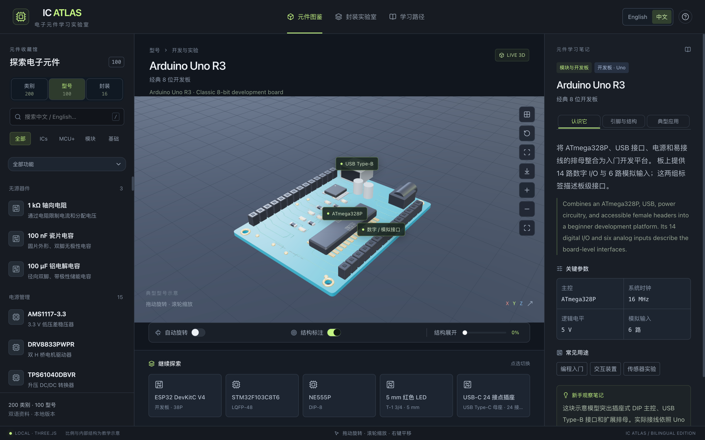
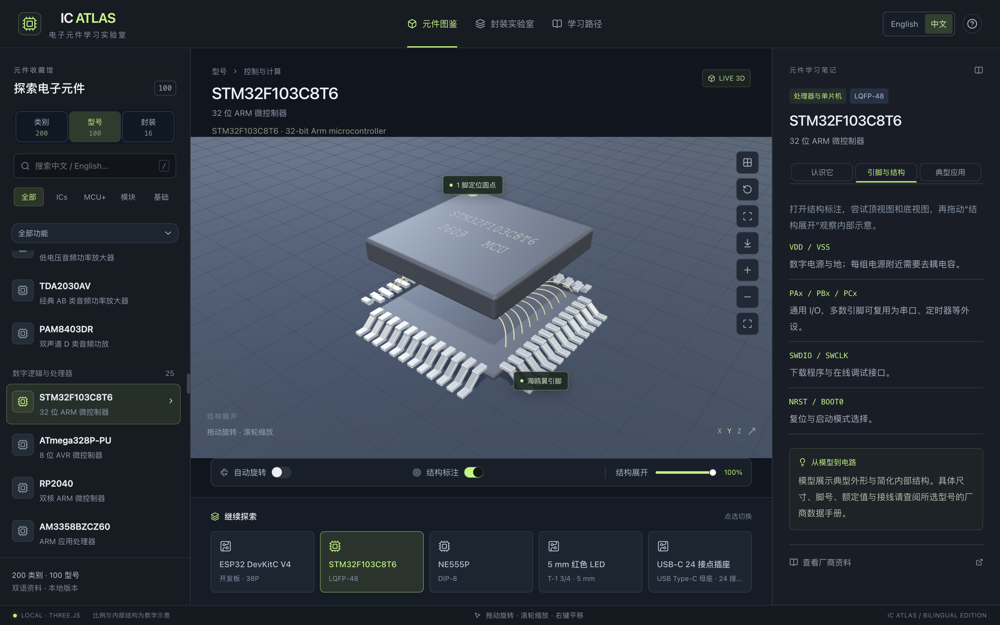
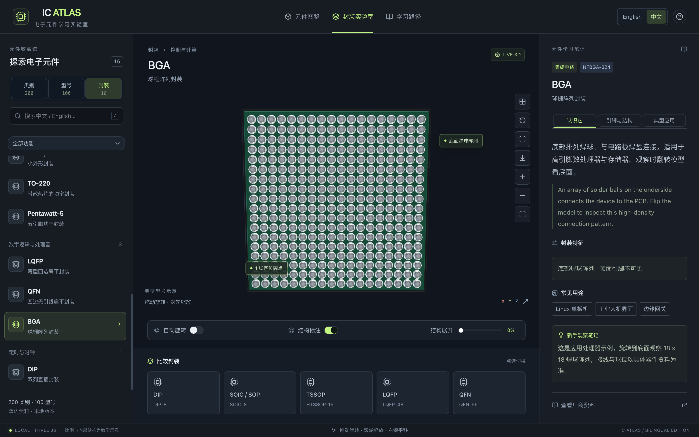

# IC Atlas

[English](README.md) | **简体中文**

基于 React 和 Three.js 的交互式 3D 电子元件学习实验室，收录 **200 类元件**、**100 个典型器件**及 **16 种常见封装**，覆盖电阻、连接器、单片机、电源芯片、射频器件等内容。

**[打开在线实验室 →](https://vaenshine.github.io/ic-atlas/)**

界面默认使用英文，可随时切换为中文，语言偏好保存在本机。搜索同时匹配中英文；学习笔记、操作界面和模型标注随所选语言切换。

## 运行截图

以下图片直接截取自实际运行的应用，展示中文操作界面与学习说明。

### 探索学习工作台

观察 Arduino Uno R3 开发板，识别处理器与连接器，并在模型旁阅读学习笔记。



### 展开内部结构

展开 STM32F103C8T6 的 LQFP 封装，观察示意引线框架与键合线，并对照右侧的引脚功能说明。



### 认识常见封装

翻转 BGA 封装，观察底部 18 × 18 焊球阵列，并通过封装目录比较其他类型。



## 学习内容

| 目录     | 内容                                                                                                                                                             |
| -------- | ---------------------------------------------------------------------------------------------------------------------------------------------------------------- |
| **类别** | 200 类元件，分为无源器件、电源管理、分立半导体、模拟与转换、数字逻辑与处理器、存储器、有线接口、传感器、光电器件、连接器、射频与无线、定时与时钟、模块共 13 组。 |
| **型号** | 100 个典型器件，包含参数、引脚说明、应用场景和厂商参考资料。类别卡片在有对应实例时提供相关型号入口。                                                             |
| **封装** | 16 种封装指南：DIP、SOIC/SOP、TSSOP/SSOP、LQFP、QFN、BGA、TO-220、SOT-223、SOT-23-5、SOT-23-6、DO-35、DO-41、SMA、TO-92、TO-263-5、Pentawatt-5。                 |

四条引导学习路径分别介绍基础器件、封装识别、开发板，以及从传感器到控制端的信号链。选中内容后，可阅读概述、结构与应用笔记。LED、RGB LED、可寻址 RGB LED、轻触开关和滑动开关模型还提供可交互的状态演示。

## 本地运行

准备 **Node.js 22.13 或更高版本**、npm，以及支持 WebGL 的浏览器。

```sh
git clone https://github.com/vaenshine/ic-atlas.git
cd ic-atlas
npm ci
npm run dev
```

打开 [http://127.0.0.1:3000/](http://127.0.0.1:3000/)。应用、学习数据及程序化模型在本机运行。安装依赖和打开厂商参考资料时需要联网。

macOS 用户也可在访达中双击[启动脚本](启动芯片实验室.command)开启本地服务；关闭它的终端窗口即可停止该服务。

构建并运行本地生产版本：

```sh
npm run build
npm start
```

## 操作方式

| 操作                       | 效果                 |
| -------------------------- | -------------------- |
| 鼠标左键拖动／触屏单指拖动 | 旋转模型             |
| 鼠标滚轮／触屏双指手势     | 缩放；双指也可平移   |
| 鼠标右键拖动               | 平移                 |
| 方向键                     | 旋转已聚焦的 3D 视图 |
| `+` / `-`                  | 缩放已聚焦的 3D 视图 |
| `0`                        | 重置已聚焦的 3D 视图 |
| `/`                        | 聚焦搜索框           |
| `Esc`                      | 退出放大浏览         |

场景工具栏提供顶视图、底视图、缩放、重置和全屏。可开启自动旋转与结构标注，或拖动展开滑块分离模型层次。“展馆总览”同时展示当前筛选的内容，点击模型即可进入独立观察。

## GitHub Pages 部署

[发布工作流](.github/workflows/pages.yml)会检查拉取请求，并将推送到 `main` 的更新部署到线上。在仓库的 **Settings → Pages → Build and deployment → Source** 中选择 **GitHub Actions**。

静态站点与本地版本共用应用代码。Vite 将 `web/` 入口构建到 `dist/pages/`，Vinext 负责本地开发与生产运行。工作流根据仓库名称生成资源基础路径，因此派生仓库可使用自己的名称部署。

构建并检查部署到域名根目录的站点：

```sh
npm run build:pages
npm run check:pages
```

对于 `https://vaenshine.github.io/ic-atlas/` 这类仓库站点，构建与检查时都需设置基础路径。macOS 或 Linux：

```sh
IC_ATLAS_BASE_PATH=/ic-atlas npm run build:pages
IC_ATLAS_BASE_PATH=/ic-atlas npm run check:pages
```

PowerShell：

```powershell
$env:IC_ATLAS_BASE_PATH = "/ic-atlas"
npm run build:pages
npm run check:pages
```

将 `dist/pages/` 的内容部署到静态托管服务。名为 `username.github.io` 的用户或组织站点使用空基础路径；使用自定义域名的根目录时，同步调整工作流中生成基础路径的步骤。

## 项目结构

| 路径                                                                                     | 用途                                                    |
| ---------------------------------------------------------------------------------------- | ------------------------------------------------------- |
| `app/page.tsx`、`app/scene.tsx`                                                          | 学习工作台、3D 渲染、视角控制、模型选择、标注与结构展开 |
| `app/data/profiles.json`                                                                 | 200 类元件的说明、代表形态与关联型号                    |
| `app/catalog.ts`、`app/data/basic.json`、`app/data/analog.json`、`app/data/digital.json` | 典型器件与封装记录                                      |
| `app/data/translations.json`、`app/i18n.ts`、`app/lessons.ts`、`app/atlas.ts`            | 多语言内容、学习路径、目录查询与双语搜索                |
| `app/models.ts`、`app/family-models.ts`、`app/special-models.ts`、`app/model-utils.ts`   | 元件、芯片封装、板卡与模块的程序化几何模型              |
| `web/`、`vite.pages.config.ts`                                                           | 静态站点入口与构建配置                                  |
| `scripts/`、`.github/workflows/pages.yml`                                                | 目录、几何与静态构建检查，以及持续部署                  |

200 类元件目录使用 **88 种代表性几何形态**，呈现引脚与焊球、绕组、电容层次、光电封装、继电器机构和连接器触点等结构。展馆模式按材质合并几何体，BGA 焊球使用实例化渲染，切换模型时释放几何体、材质和纹理。界面遵循减少动态效果的系统偏好，并在 WebGL 无法使用时显示提示。

## 验证与贡献

```sh
npx tsc --noEmit
npm run check:models
npm run check:catalog
npm run build:pages
npm run check:pages
```

检查覆盖目录完整性、翻译、双语搜索、数值参数、有限几何坐标、引脚与接点及焊球数量、标注、结构展开和静态资源路径。几何检查使用最小画布模拟环境，浏览器中的视觉检查可补充这些自动验证。

扩展目录时，在 `app/data/profiles.json` 中添加对应的中英文记录，选择合适的形态，并按需补充几何模型和双语结构标注。类别示意与具体型号实例应清楚标识。来源要求和提交流程见[贡献指南](CONTRIBUTING.md)。

## 教学范围

模型用于展示典型外形与简化的内部结构。尺寸、芯片布局、键合线、PCB 走线和丝印均为教学近似。核对尺寸、脚号、额定值、电气连接与布局时，应以所选厂商、具体料号及硬件版本的数据手册为准。同一类元件可能采用多种封装。

## 许可证与来源

原创应用代码、程序化几何模型及说明内容采用 [MIT 许可证](LICENSE)。第三方依赖保留各自的许可证，完整声明收录于 [THIRD_PARTY_NOTICES.md](THIRD_PARTY_NOTICES.md) 和静态站点。每次静态构建还会生成 `bundled-dependencies.json`，记录实际打包依赖的许可证。

厂商名称、产品标识与来源链接用于说明实例和参考资料。链接文档及商标的权利归各自所有者。参考链接与模型实现保留在源代码中，便于贡献者核对与改进。
